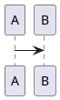
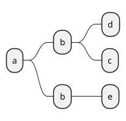

# Ermine

超簡単な機械学習

## 1. Ermineて何？

Ermineはユニットで構成された機械学習プログラムの実行ツールです。TensorFlowベースの学習、Optunaによるハイパーパラメータ調整をGUIにてサクサク行うことができます。（現在はまだ画像分類タスクしかサポートしていません。）

## 2.Installation

```
> pip install ermine

```

## 3.簡単な例 (Mnist)

はじめにサーバーを実行します。

```
> ermine-web &

```

http://localhost:7007/ をブラウザで開きます。

作成->新規画像分類タスクを選択します。

mnistデータセットを選択します。
CNNのモデルを選択します。
学習用の設定を行います。

実行します。実行の状況はTensorBoardで確認できます。

## 4. Custom Training.

Press trainig tab.

add units for your training.

configurate your 

Machine learning trainig process will have units bellow.

|Ermine Unit|Unit Explanation| |
|:--|:--|:--|
|Dataset Unit|some dataset preparation kit such as mnist or your custom datasets| |
|Data Augument Unit|some dataset preparation kit such as mnist or your custom datasets| |
|Model Unit| | |
|Pipline Unit|tune the machine learning input pipeline to be more faster| |
|Training Output Unit| | |

### 3.2. Inference/Test

|Ermine Unit|Unit Explanation| |
|:--|:--|:--|
|Dataset Unit|Dataset preparation unit such as mnist or your custom datasets.| |
|Inference Unit|Infer with datsets.| |
|Evaluation Output Unit|outputs result of the inferences in the specified format.|

# 4. GPUの使用

GPUを使用した学習はインストール時にTensorFlow-GPUをインストールすことにより自動的に選択されます。


# 5. Distribute Training.

Now prinitng...

# 6. Validation of your training.

Now prinitng...


# 7. How to use ermine trained model in your program.


Ermine model can be transformed to TensorFlow Estimator. So create instance and.

# 8. ハイパーパラメータのチューニング

ErmineはOptunaを使用します。データベースがあるとき、データベースを使った分散最適化を実施することが可能です。


## 5. Ermineユニットの作成

Ermineはユニットを追加することで、あなたの作成した機能を自由に使用することができます。

### 5.1.  ユニットの新規作成

Ermineでは各モジュールをユニットと呼び、ユニットを連結して機械学習プログラムを実現します。機械学習タスクのユニットは、以下のようなコンポーネント種別により分類されます。

Ermineでは機械学習タスクのコンポーネントに応じたスーパークラスが存在し、abstractmethodを持っています。そのサブクラスをシステム上に追加してください。

__画像分類タスク__
|作成ユニット種別|使用するスーパークラス|役割|
|:--|:--|:--|
|画像データセット|ImageClassificationDataset|画像データ、ラベル情報からなる、学習、バリデーション、テストセットを提供します。|
|画像の変形|ImageTransform|学習、バリデーション、テストセット画像データに必要な前処理を提供します。|
|画像の拡張|ImageAugmentation|学習（バリデーション）|
|モデル|ImageClassificationModel| |
|学習|ImageClassificationTraining| |

たとえば、次のような３種類の画像からなる、データセットを作成してみましょう。


### 5.2. 新しいユニットをErmineに追加する




```plantuml
@startuml
!define start(yyyy,mm,dd) Project starts yyyy/mm/dd
!define task(x,d) [<font:SansSerif>x</font>] lasts d days
!define off_saturday saturday are closed
!define off_sunday sundays are closed
!define holiday(yyyy,mm,dd) yyyy/mm/dd is closed
!define next_task(x,y) [<font:SansSerif>y</font>] starts at [<font:SansSerif>x</font>]'s end

start(2019,6,10)
off_saturday
off_sunday

holiday(2019,6,17)

task(日本語入力,10)
then task(日本語2,5)
[mileston] happens at 2019/06/20
task(3,60)


@enduml
```

