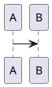
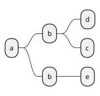

# shphinx

# flask

# PyPI

* 自作モジュールを用意する
まずは作業をするための自作モジュールのディレクトリを作り、その中に移動します。ディレクトリはなんでもいいですが、わかりやすいようモジュール名と同じにしておきます。

```
$ mkdir libhollow
$ cd libhollow

```
このディレクトリ内部に __init__.py を作成します。中身は空でよいので touch コマンドで作ります。
```
$ touch libhollow/__init__.py

```

同じくモジュールに含める Python のコードも入れておきます。ここでは libhollow/jackolantern.py というファイル名で、以下の Python コードを置いておきます。

``` 
def call():
    print "Trick or Treet"
```

次に、pip がこのモジュールを認識できるよう、setup.py という Python ファイルを作ります。中身は以下の通りです。

```
import setuptools
 
setuptools.setup(
    name="libhollow",
    version="1.0",
    author="momokan",
    author_email="momokan@example.com",
    description="libhollow is my own python package",
    long_description="The halloween party has gone over...",
    long_description_content_type="text/markdown",
    url="https://blog.chocolapod.net/momokan",
    packages=setuptools.find_packages(),
    classifiers=[
        "Programming Language :: Python :: 2.7.14",
        "License :: OSI Approved :: MIT License",
        "Operating System :: OS Independent",
    ]
)
```

自作モジュールの呼び出し側では、pip install コマンドの引数に自作モジュールの Git リポジトリのパスを指定することで、自作モジュールをインストールすることができます。ここではインストールする Git リポジトリのパスを /home/momokan/python/libhollow とします。


```
$ pip install git+file:///home/momokan/python/libhollow -t lib

```

上記の解説ではeasy_installを使用していますが、pip install Sphinxや、Anaconda/Minicondaを使っていればconda install Sphinxでも導入可能です。

The scripts Keyword Argument
The first approach is to write your script in a separate file, such as you might write a shell script.:

funniest/
    funniest/
        __init__.py
        ...
    setup.py
    bin/
        funniest-joke
    ...
The funniest-joke script just looks like this:

#!/usr/bin/env python

import funniest
print funniest.joke()
Then we can declare the script in setup() like this:

setup(
    ...
    scripts=['bin/funniest-joke'],
    ...
)


flask

# Flask などの必要なライブラリをインポートする
from flask import Flask, render_template, request, redirect, url_for
import numpy as np

# 自身の名称を app という名前でインスタンス化する
app = Flask(__name__)

# メッセージをランダムに表示するメソッド
def picked_up():
    messages = [
        "こんにちは、あなたの名前を入力してください",
        "やあ！お名前は何ですか？",
        "あなたの名前を教えてね"
    ]
    # NumPy の random.choice で配列からランダムに取り出し
    return np.random.choice(messages)

# ここからウェブアプリケーション用のルーティングを記述
# index にアクセスしたときの処理
@app.route('/')
def index():
    title = "ようこそ"
    message = picked_up()
    # index.html をレンダリングする
    return render_template('index.html',
                           message=message, title=title)

# /post にアクセスしたときの処理
@app.route('/post', methods=['GET', 'POST'])
def post():
    title = "こんにちは"
    if request.method == 'POST':
        # リクエストフォームから「名前」を取得して
        name = request.form['name']
        # index.html をレンダリングする
        return render_template('index.html',
                               name=name, title=title)
    else:
        # エラーなどでリダイレクトしたい場合はこんな感じで
        return redirect(url_for('index'))


@app.route('/name/<name>.json')
def hello_world(name):
  greet = "Hello %s from flask!" % name
  result = {
    "Result":{
      "Greeting": greet
      }
  }
  return jsonify(ResultSet=result)

if __name__ == '__main__':
    app.debug = True # デバッグモード有効化
    app.run(host='0.0.0.0') # どこからでもアクセス可能に


# pytest

@pytest.mark.xxxx

def reducer(array_val, la_bel):
    c = tf.cast(label, tf.int32)
    x = tf.gather(array_val,c)
    x = x + 1
    array_val = tf.tensor_scatter_update(array_val,[[c]],[x])
    return array_val

array_val = train_dataset.reduce(array_val, reducer)
<<<<<<< HEAD


import tensorflow as tf
import os
os.environ['TF_CPP_MIN_LOG_LEVEL'] = '3'

tf.logging.set_verbosity(tf.logging.ERROR)

d = [(0,0),(1,0),(2,0),(0,1),(1,1),(2,1),(0,2),(1,2),(2,2),(0,0),(1,0),(2,0),(0,1),(1,1),(2,1),(0,2),(1,2),(2,2)]
ds = tf.data.Dataset.from_tensor_slices(d)

def to_class(d):
    x = tf.gather(d,indices=[0],axis=0)
    x = tf.reshape(x, shape=[] )
    return x

ds = ds.apply(tf.data.experimental.rejection_resample(to_class,target_dist=[0.1,0.1,0.8],initial_dist=[0.33,0.34,0.33]))


with tf.Session() as sess:
    sess.run(tf.global_variables_initializer())
    iterator = ds.make_one_shot_iterator()
    next = iterator.get_next()
    try:
        while True:
            print('Got !!' , sess.run(next))
    except tf.errors.OutOfRangeError as error:
        print('end')


 190010467
 190010443
 190010445
 190010449
 
=======
>>>>>>> e5ac523ad93226b384a05a1257124502774dc217


# TFX


#### サブクラスの取得
追記
やっぱりあった。

id:mopemope さん『何もしなくてもOutputBase.__subclasses__()でいけるはずです』


class OptunaCallback(Callback):
    def __init__(self, trial):
        self.trial = trial

    def on_epoch_end(self, epoch, logs):
        current_val_error = 1.0 - logs["val_acc"]
        self.trial.report(current_val_error, step=epoch)
        # 打ち切り判定
        if self.trial.should_prune(epoch):
            raise optuna.structs.TrialPruned()


#### モデルの評価

- AUC/ROC しきい値の設定
- 
tf.keras.metrics.AUC


### 評価タスクの実行

- データセットの選択
- 前処理条件の選択
- モデルファイルの選択
- クラス敷居値オプション
- CSV結合オプション
- 画像保存オプション
- yellowbrick


### Angular

#### ElectronとAngularの関係
- https://github.com/maximegris/angular-electron/blob/master/README.md


#### Angular
#### コンポーネントの作成

```
> ng g component new_component_ベース名

```

#### プロパティの追加

```
export class FooComponent implements OnInit {

    bar:string = "hoge";

    constructor(){
        this.bar = "hogehoge";
    }

    fooMethod(): void {
        this.bar = "FooChange";
    }

```

#### バインディング

プロパティを単方向で

```

{{hoge}}

```

イベントを単方向で

```
<button (click)="fooMethod()">hoge</button>

```

双方向で

```

<input [(ngModel)]="プロパティ名">

```

#### フォームの利用(テンプレート駆動)

app.module.tsにフォームモジュールの追加

```
import {FormModules} from '@angular/forms';

```

テンプレートにngModelで結びつけ

```
<input [(ngModel)]="プロパティ名">

```

#### フォームの利用(リアクティブフォーム)

app.modules.tsにフォーム関係モジュールを追加する。

```
import {FormGroup, FormControl, ReactiveModule} from '@angular/forms';

()

imports: [
    BrowserModule,
    ReactiveFormsModule
]

```


### ドロップダウン

ng-For

### サービス


### ルーティング
### Electronでローカル画像を触る

```
  mainWindow = new BrowserWindow({
    webPreferences: {
      webSecurity: false
    }
  })

```

### 
CSVファイルのロード

### 

画像、クラシフィケーションタスクの設定

* データセット (画像、ラベル、ID)
* 


## 適合率

　適合率（precision、精度と訳されることもあります）は、いわば「どれだけ嘘の分類結果が少ないか」の指標です。端的にいうと、Positiveと判定されたものの中にどれだけPositiveが含まれているかの割合です（ちなみにNegativeでも理屈の上では同様に計算できる。これについてはずっと後ろで後述する）。インフルエンザ検査で例えると、検査が陽性になったけど実はインフルエンザにかかっていませんでした、という人がどれだけいるかの指標になります。


## 再現率

　再現率(rcall)は、「どれだけ取りこぼさないで分類できたか」の指標です。真値がPositiveの人の何割をPositiveと判定できたかを表します。インフルエンザ検査では、インフルエンザにかかってるのに検査しても陽性にならなかった、という人がどれだけいるかの指標になります。

## F1値

この適合率と再現率には、実はトレードオフがあります。上の例で、それぞれ適合率がほぼ100%のときの再現率、再現率が100%のときの適合率を考えてみると理解できるかと思います。そこで、中間くらいを取ってやれ、という指標を考えることができます。平均で良いじゃん、と思う訳ですが、実際には調和平均を使います。それがF1値（F1 measure）です。

F1値は分類結果の直接の良し悪しの指標になります。ですから、論文などではこれの改善*3を以て提案手法の有効性をアピールする、といったことがよく行われます。


### 適合値

Precision= TP/(TP+FP)

### 再現率

Recall=TP/(TP+FN)

## F1-measure

F1−measure=(2TP)/(2TP+FP+FN)

バイナリ分類問題のプロセスとは異なり、予測を行うのにスコアしきい値を選択する必要はありません。予測される回答は、予測スコアが最も高いクラス (つまり、ラベル) です。時には、スコアが高いと予測される場合にのみ予測回答を使用することもできます。この場合は、予測された回答を受け入れるかどうかを決定するための予測スコアのしきい値を選択することができます。

## one versus one / one versus others


```

>>> true = [0,0,0,0,0,1,1,1,1,1,2,2,2,2,2,3,3,3,3,3]
>>> pred = [0,0,1,1,1,0,1,1,1,1,2,1,1,2,2,3,2,1,3,3]
>>> from sklearn.metrics import confusion_matrix
>>> confusion_matrix(true, pred)

```

```
>>> true = [0,0,0,0,0,1,1,1,1,1,2,2,2,2,2,3,3,3,3,3]
>>> pred = [0,0,1,1,1,0,1,1,1,1,2,1,1,2,2,3,2,1,3,3]
>>> from sklearn.metrics import precision_recall_fscore_support
>>> precision_recall_fscore_support(true, pred)
(array([0.66666667, 0.4       , 0.75      , 1.        ]),
 array([0.4, 0.8, 0.6, 0.6]),
 array([0.5       , 0.53333333, 0.66666667, 0.75      ]),
 array([5, 5, 5, 5])) # 結果は見やすいよう整形しています

```



```plantuml
@startuml
!define start(yyyy,mm,dd) Project starts yyyy/mm/dd
!define task(x,d) [<font:SansSerif>x</font>] lasts d days
!define off_saturday saturday are closed
!define off_sunday sundays are closed
!define holiday(yyyy,mm,dd) yyyy/mm/dd is closed
!define next_task(x,y) [<font:SansSerif>y</font>] starts at [<font:SansSerif>x</font>]'s end

start(2019,6,10)
off_saturday
off_sunday

holiday(2019,6,17)

task(日本語入力,10)
then task(日本語2,5)
[mileston] happens at 2019/06/20
task(3,60)


@enduml
```




* 評価に関してはCSV値を取得する。

* train_image
    - 学習の直前の画像を保存する?


* get_roc_auc_score()
    - rocとaucのJSONファイルを取得
* get_prediction():
    - image列の画像の取得

* プレディクションファイル -> *__prediction.csv
* roc_auc

* 比較はあとででねー。
    